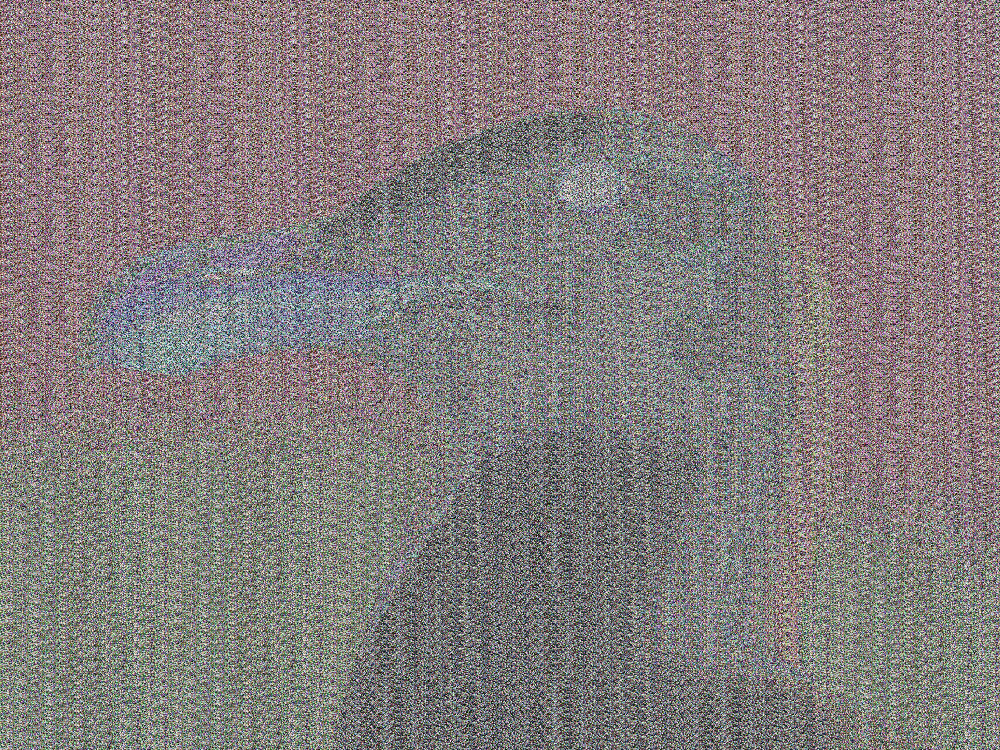

# Mini Project

## Introduction:

This repository is for our semester mini project on machine learning and visual cryptography.

This repository will contains all the code, data, and documentation related to our project, including the implementation of the machine learning models and the visual cryptography algorithm, as well as sample datasets and instructions on how to run the code.

## Task 1

Verify the results using some image from the ensemble model in given repository.

[Covid-19 Detection Using Ensembling](https://github.com/CUIEMCovidProject/COVID-19-Detection-Using-Ensemble-Learning)

Result

## Task 2

Extract the features from any three models and apply features selector algorithms - ReliefF and Chi2 on it. Then use the selected features for classification using Decision Tree and Support Vector Machines.

[Dataset](https://www.kaggle.com/datasets/tawsifurrahman/covid19-radiography-database)

## Task 3

Combine features from different models (Ensemble) and use ReliefF on them.

[Dataset](https://www.kaggle.com/datasets/tawsifurrahman/covid19-radiography-database)

[Reference Notebook](https://github.com/IbrahimSobh/kaggle-COVID19-Classification/blob/master/chest%20x-ray%20covid19%20efnet%20densenet%20vgg%20Grad-CAM.ipynb)

## Task 4

Implement image encryption using hyperchaotic maps (Logistic Map).

[Reference Notebook](https://github.com/IbrahimSobh/kaggle-COVID19-Classification/blob/master/chest%20x-ray%20covid19%20efnet%20densenet%20vgg%20Grad-CAM.ipynb)

Results

- Encrypted

- Decrypted

## Technology Stack:
  1) Tensorflow
  2) Keras

## Contributors:

* [Kunal Katiyar](https://github.com/kunal2812)
* [Nandini Karad]()
* [Lakshay](https://github.com/lakshayk4242)
* [Prince Verma]()
